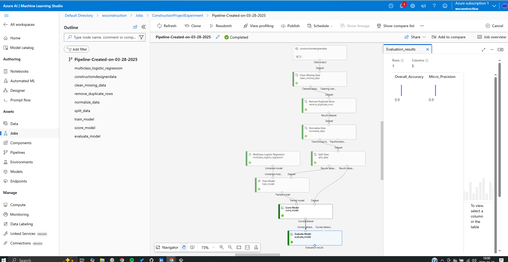
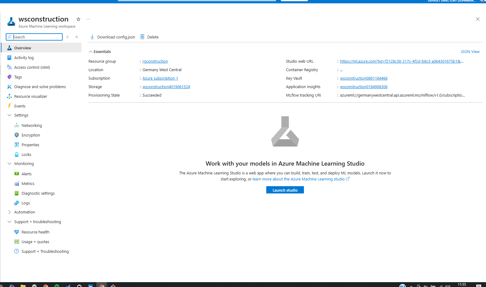
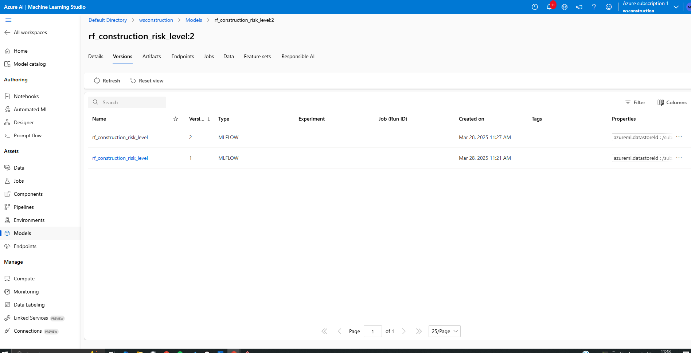
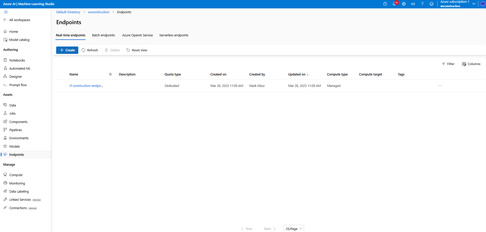

# Construction Risk Prediction with Azure ML Studio

## Project Overview
This project predicts the risk level of construction projects based on various factors. It was implemented using **Azure Machine Learning Studio**, leveraging its workspace, dataset management, and model deployment services and designer.

### Model Training using Designer
- Configured an experiment and ran model training in Azure ML Studio in Designer.


## Steps in Azure ML Studio Implementation

### 1. Setting Up Azure ML Workspace
- Created an Azure Machine Learning workspace in Azure Portal.
- Configured a compute instance for training.



### 2. Model Registration
- Ran the notebook with all the necessary steps to creating the RandomForest model
- Registered the trained model in the **Models** section of Azure ML Studio.



### 3. Deployment
- Deployed the model as an **Real-Time endpoint** in Azure ML Studio.



### 4. Troubleshooting & Logs
- Encountered quota issues when selecting compute SKU.

## How to Run the Project
1. Clone this repository:
   ```bash
   git clone https://github.com/your-username/construction-risk-prediction.git
   ```
2. Navigate to the project folder:
   ```bash
   cd construction-risk-prediction
   ```
3. Open the Jupyter Notebook in Azure ML Studio and run the cells.
4. Access the deployed model endpoint using:
   ```python
   import requests
   response = requests.post('https://your-endpoint-url', json={})
   print(response.json())
   ```

## References
- [Azure ML Studio Overview](https://learn.microsoft.com/en-us/azure/machine-learning/)
- [Deploying a Model in Azure ML](https://learn.microsoft.com/en-us/azure/machine-learning/concept-endpoints)

